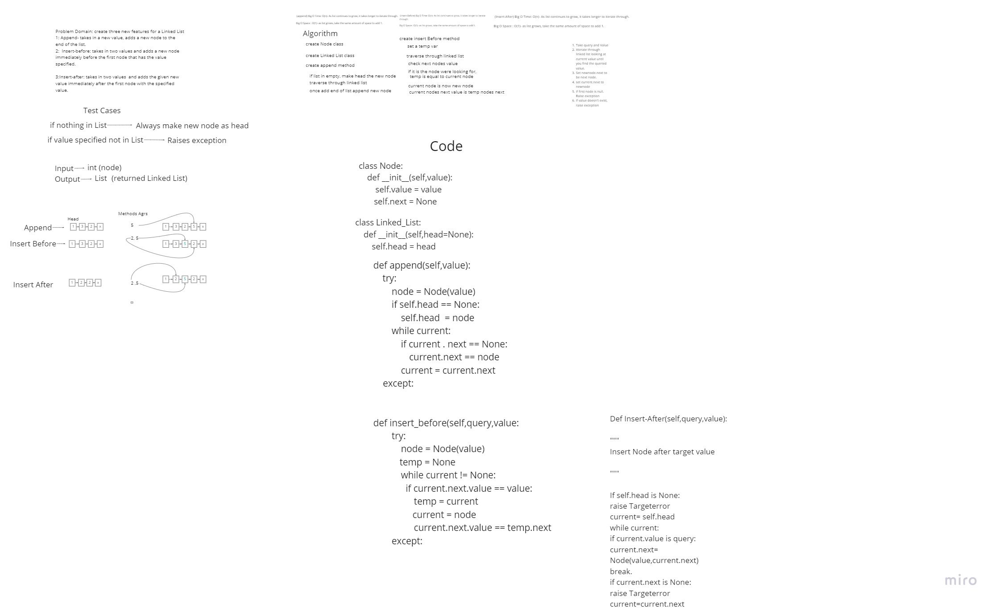
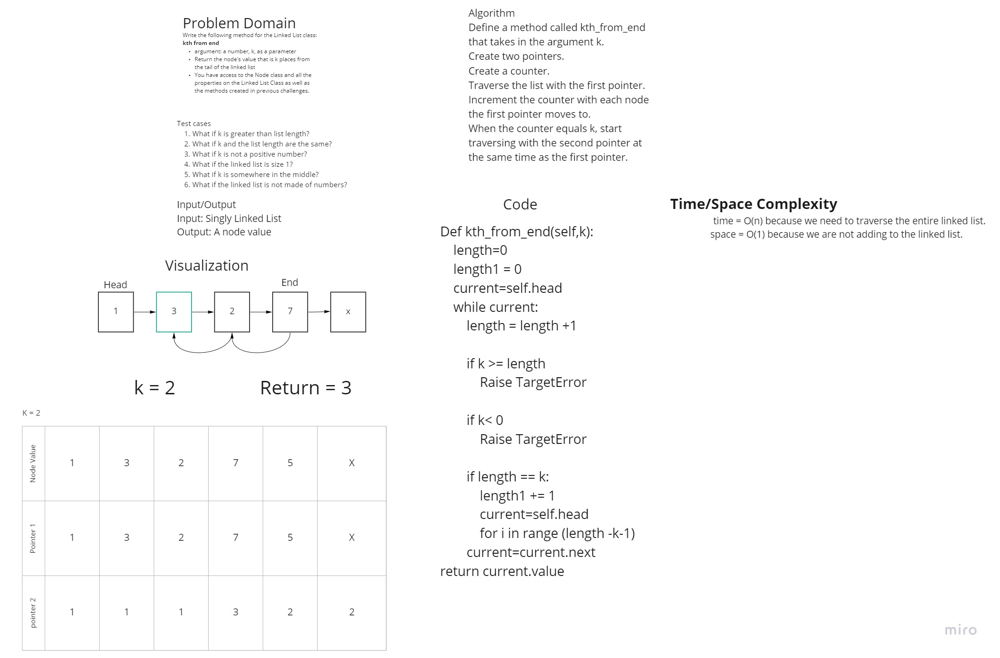

# Challenge Summary
<!-- Description of the challenge -->
### Feature Tasks Code Challenge Class 06
**Write the following methods for the Linked List class:**

- append
    - arguments: new value
    - adds a new node with the given value to the end of the list
- insert before
    - arguments: value, new value
    - adds a new node with the given new value immediately before the first node that has the value specified
- insert after
    - arguments: value, new value
    - adds a new node with the given new value immediately after the first node that has the value specified

## Whiteboard Process
<!-- Embedded whiteboard image -->

## Code
[Linked List code](./linked_list.py)

## Approach & Efficiency
<!-- What approach did you take? Why? What is the Big O space/time for this approach? -->

Traversed through the list and looked for the value specified, if no value, then insert new value at head, otherwise insert either before or after or at end depending on the method

> append - Time = O(n), Space = O(1)
insert_before - Time = O(n), Space = O(1)
insert_after - Time = O(n), Space = O(1)

## Solution
<!-- Show how to run your code, and examples of it in action -->

>Linked_List.append(5)--> adds new node at the end

>Linked_List.insert_before(3,5)--> adds new node with a value of 5 before the node with a value of 3

>Linked_List.insert_after(3,5)--> adds new node with a value of 5 after the node with a value of 3

## Unit Tests
- Can successfully add a node to the end of the linked list
- Can successfully add multiple nodes to the end of a linked list
- Can successfully insert a node before a - node located i the middle of a linked list
- Can successfully insert a node before the first node of a linked list
- Can successfully insert after a node in the middle of the linked list
- Can successfully insert a node after the last node of the linked list   

# Challenge Summary
<!-- Description of the challenge -->
### Feature Tasks Code Challenge Class 07
**Write the following methods for the Linked List class:**

- kth from end
    - arguments: new value
    - adds a new node with the given value to the end of the list

## Whiteboard Process
<!-- Embedded whiteboard image -->

## Code
[Linked List code](./linked_list.py)

## Approach & Efficiency
<!-- What approach did you take? Why? What is the Big O space/time for this approach? -->

## Solution
<!-- Show how to run your code, and examples of it in action -->

## Unit Tests
